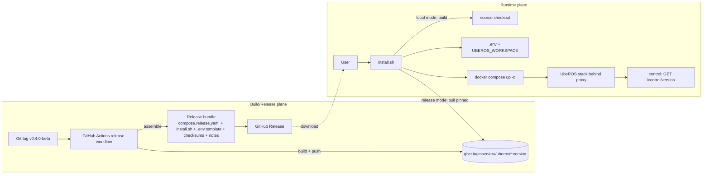

<!-- markdownlint-disable-file -->
<!-- markdown-table-prettify-ignore-start -->
## UbeROS Release, Packaging and Distribution - Product Requirements Document (PRD)
Version 1.0.0 | Status Approved | Owner jmservera | Team Squad | Target Next iteration | Lifecycle Approved

## Progress Tracker
| Phase | Done | Gaps | Updated |
|-------|------|------|---------|
| Context | 95% | Derived from the approved Release, Packaging & Distribution BRD (all decisions resolved) | 2026-07-26 |
| Problem & Users | 90% | Personas confirmed from the BRD (consumer, ROS developer, platform maintainer, release manager) | 2026-07-26 |
| Scope | 90% | ghcr + GitHub Releases + Git-tag versioning + dual-mode installer confirmed | 2026-07-26 |
| Requirements | 90% | FR/NFR across eight themes mapped from BR-001…BR-016 | 2026-07-26 |
| Metrics & Risks | 90% | <5-min first-run target; release/local drift and package-mode risks captured | 2026-07-26 |
| Operationalization | 90% | Pipeline on `v*` tag, bundle assembly, installer upgrade path confirmed | 2026-07-26 |
| Finalization | 100% | All open questions resolved; approved 2026-07-26 | 2026-07-26 |
Unresolved Critical Questions: 0 | TBDs: 0

This PRD implements the [Release, Packaging and Distribution BRD](../brds/004-uberos-release-packaging-brd.md).
It turns the BRD's business requirements (BR-001…BR-016) into a concrete technical design for a
semantic-versioned release pipeline, a distributable release bundle, and a dual-mode installer.

## 1. Executive Summary
### Context
UbeROS is a browser-based ROS 2 development environment delivered as a multi-service Docker Compose
stack (`discovery-server`, `ros`, `gazebo`, `turtlesim`, `editor`, `frontend`, `proxy`, `control`)
behind a single Nginx ingress. Today the only supported way to run it is to clone the repository and
`docker compose up`, which builds every image locally. There is no versioned artifact, no guided
setup, and the ROS workspace (`./workspace`) lives inside the repository, so normal use dirties the
checkout (Issue #29).
### Core Opportunity
Turn UbeROS from a **clone-and-build project** into a **versioned, installable product**. An automated
pipeline stamps a **semver** version from the **Git tag**, publishes per-service images to
**ghcr.io**, and attaches a **release bundle** to a **GitHub Release**. A single **installer** then
provisions and starts the stack either from those **released packages** (release mode) or from
**local source** (local mode, no packages needed), decouples the ROS workspace from the repository,
surfaces the running version, and makes optional packages selectable — all targeting a **first run
under 5 minutes** on a clean host.
### Goals
| Goal ID | Statement | Type | Baseline | Target | Timeframe | Priority |
|---------|-----------|------|----------|--------|-----------|----------|
| G-001 | Run UbeROS from a versioned release without cloning/building | Capability | Clone-and-build only | One-command install; UI reachable < 5 min on a clean host | This iteration | Must |
| G-002 | Reproducible, semver artifacts from the Git tag | Reliability | No versioned artifacts | Immutable images + bundle per tag, pinned | This iteration | Must |
| G-003 | Automated release pipeline on tag | Capability | Manual local build | `v*` tag builds, versions, publishes everything | This iteration | Must |
| G-004 | One installer, two modes (release or local) | Capability | Local build only | Same installer provisions from packages or source | This iteration | Must |
| G-005 | Workspace decoupled from the repository | Reliability | Workspace in repo | `git status` clean during normal use | This iteration | Must |
| G-006 | Guided + non-interactive configuration | Usability | Manual `.env` edits | Prompts with defaults and a scriptable path | This iteration | Should |
| G-007 | Version transparency | Observability | No version surfaced | Version visible in UI and CLI (`0.4.0-beta`) | This iteration | Should |
| G-008 | Configurable optional packages | Capability | Hand-edited files | Installer selects optional package sets (#19, #30) | This iteration | Should |
### Objectives (Optional)
| Objective | Key Result | Priority | Owner |
|-----------|------------|----------|-------|
| Make UbeROS installable | A tagged release installs and runs with no source checkout in < 5 min | Must | Squad |
| Keep dev and release honest | Both installer modes exercised in CI on every change | Must | Squad |

## 2. Problem Definition
### Current Situation
`docker compose up` from a clone builds all images locally. Nothing stamps a version onto a run; the
`./workspace/src` bind mount and committed `workspace/` dirty the checkout; optional packages are
changed by editing Dockerfiles by hand.
### Problem Statement
There is no releasable, versioned form of UbeROS, no guided install, no way to run from published
artifacts, and no clean separation between the product source and user workspace content. Contributors
also cannot exercise the installer without first publishing packages.
### Root Causes
* The project is modeled as a source tree to build, not a product to release; there is no pipeline that versions and publishes artifacts.
* Compose services declare `build:` only; there is no published `image:` to pull, so every start is a build.
* The workspace is a repo-relative bind mount (`./workspace/src:/ros_ws/src`) instead of an external, user-owned location.
### Impact of Inaction
Onboarding stays slow and error-prone, runs are non-reproducible and unsupportable, and using the
product keeps polluting the repository.

## 3. Users & Personas
| Persona | Goals | Pain Points | Impact |
|---------|-------|------------|--------|
| End user / evaluator | Install and run a release fast | Must clone and build everything | Adoption |
| ROS Developer (primary) | Keep workspace outside the repo; upgrade safely | Dirty checkout; no versioned upgrades | Daily productivity |
| Platform Maintainer | Configure install, pin versions, run upgrades | Manual `.env`, no version pinning | Operability |
| Release Manager | Cut versioned releases, publish artifacts, keep a changelog | No release process at all | Supportability |
### Journeys (Optional)
A maintainer pushes tag `v0.4.0-beta`; CI builds and publishes images to ghcr.io and a bundle to the
GitHub Release. An evaluator downloads the bundle, runs `./install.sh`, accepts defaults, and reaches
the UI in a few minutes from pinned images. A contributor runs `./install.sh --mode local` in a
checkout to build and test the same flow with no published packages.

## 4. Scope
### In Scope
* A **release pipeline** (GitHub Actions) triggered on a `v*` Git tag that builds, versions, and publishes all artifacts.
* **Semantic versioning** (semver 2.0.0) derived from the Git tag, including `-beta` pre-releases and build metadata.
* Publishing **per-service container images** to **ghcr.io** tagged with the release version.
* A **release bundle** (release compose file, installer, `.env` template, checksums, release notes) attached to a **GitHub Release**.
* A **dual-mode installer**: release mode (pull pinned images) and local mode (build from source, no packages).
* **Guided** and **non-interactive** installation with sensible defaults.
* **Workspace decoupling**: external/user-defined workspace path, optional existing Git repo, migration of the current `./workspace`.
* **Version transparency**: version stamped into artifacts and surfaced by the control plane and UI.
* **Optional packages**: simulator set (runtime); learning packages (optional at build, published as per-package release images, turtlesim first); editor extensions are always installed (not optional).
* **x86_64** hosts including the GPU overlays (`compose.override.{wsl,intel,gpu}.yaml`).
* **Re-run/upgrade** support (idempotent installer) and **checksum** verification.
### Out of Scope (justify if empty)
* Third-party marketplaces / OS package managers (apt, brew, winget).
* Artifact **signing** — deferred to the Security & Quality track (Issue #15); checksums cover integrity now.
* Auto-update/self-update daemons (installer re-run is the upgrade path).
* **ARM/Apple-silicon (arm64)** images/installer — deferred; the README invites tester help.
* Changing the single-proxy topology or host-publishing backend ports.
* Building the specific optional packages themselves (Issues #19, #30) beyond making them selectable.
### Assumptions
* Docker and Docker Compose v2 remain the runtime; releases are consumed with the same tooling.
* ghcr.io is the image registry and GitHub Releases the bundle channel, both on the repo.
* The Git tag is the single source of truth for a release version.
* `ROS_DISTRO`/`GZ_RELEASE` stay parameterized via `.env` (ADR-001) and flow into releases.
* Init constraints hold: single ingress, backend ports internal, single-user now, multi-user not precluded.
### Decisions (resolved from the BRD, 2026-07-26)
* **Registry:** ghcr.io (BRD §10.1). **Channel:** GitHub Releases; the bundle is the distributable (BRD §10.2).
* **Version source:** Git tag (BRD §10.3). **Phase:** early beta; initial version **`0.4.0-beta`** (BRD §10.4).
* **Optional packages:** configurable selection in scope (BRD §10.5); building the packages themselves is not.
* **Optional packages:** editor extensions (#30) are always installed in the editor image (not selectable); learning packages (#19) are optional at build and published as per-package release images (turtlesim only, for now).
* **Signing:** deferred to Issue #15 (BRD §10.6). **First-run:** < 5 min on a clean host (BRD §10.7).
* **Platform:** x86_64 incl. GPU overlays now; ARM/Apple-silicon deferred (BRD §10.8).
### Constraints
* Single reverse proxy; backend ports never host-published.
* Committed defaults contain no secrets; the bundle must not embed secrets.
* Release mode must not require a source checkout; local mode must not require published packages.
* Must not regress the GPU overlays or the native-Linux path.

## 5. Product Overview
### Value Proposition
UbeROS becomes a versioned product you can install in minutes from a GitHub Release, or build from
source with the very same installer, while your ROS workspace lives safely outside the repository.
### Differentiators (Optional)
* One installer, two modes: released packages **or** local source, sharing one compose definition.
* Reproducible, Git-tag-versioned images on ghcr.io with a checksummed bundle.
* Workspace decoupling that keeps the source tree clean during real use.
### UX / UI (Conditional)
The installer is a POSIX shell script with an interactive wizard (prompts + defaults) and a
non-interactive flag/config path. The running version appears in the frontend **system menu**
(an "About / Version" entry backed by `GET /control/version`). UX Status: Draft.

## 6. Solution Architecture
### Component model
Two planes: a **build/release plane** (GitHub Actions → ghcr.io + GitHub Releases) and a **runtime
plane** (installer → Docker Compose stack). The installer is the single entry point for both modes and
shares one compose definition; release mode adds a generated overlay that pins `image:` tags, local
mode uses the existing `build:` stanzas.

### Versioning and image naming
The Git tag `vMAJOR.MINOR.PATCH[-prerelease][+build]` is the source of truth. The pipeline strips the
leading `v` and stamps that version onto every artifact. Images publish as
`ghcr.io/jmservera/uberos/<service>:<version>` (for example
`ghcr.io/jmservera/uberos/frontend:0.4.0-beta`), plus a moving channel tag `:beta` for the latest
pre-release (pinned exact tag is always the reproducible reference).

### Compose strategy (one definition, two modes)
* `compose.yaml` keeps `build:` for local mode (unchanged behavior).
* The pipeline generates `compose.release.yaml` — the same services with `image:` pinned to the version and **no** `build:` — attached to the bundle.
* Release mode runs `docker compose -f compose.release.yaml --env-file .env pull && ... up -d`.
* Local mode runs `docker compose build && ... up -d`.
* GPU overlays (`compose.override.{wsl,intel,gpu}.yaml`) apply in both modes via additional `-f` flags, unchanged.

### Workspace decoupling
Introduce `UBEROS_WORKSPACE` (default `./workspace`). Compose binds `${UBEROS_WORKSPACE}/src` into the
`ros` and `editor` services instead of the repo-relative path. The installer sets `UBEROS_WORKSPACE` to
a user-chosen external directory, initializing it from a template or from an existing Git repository,
and can migrate the current `./workspace`. With the workspace external, `git status` on the source
stays clean during normal use.

## 7. Functional Requirements

### 7.1 Theme A — Semantic versioning (Git tag)
| FR ID | Requirement | Goals | Priority | Acceptance | BR |
|-------|-------------|-------|----------|-----------|----|
| FR-A1 | Versions follow semver 2.0.0 (`MAJOR.MINOR.PATCH`, optional `-prerelease` and `+build`). | G-002 | Must | Version strings validate against the semver grammar. | BR-002 |
| FR-A2 | The release version is derived from the Git tag (`v<version>`), the single source of truth. | G-002 | Must | The published artifacts' version equals the tag minus the leading `v`. | BR-002 |
| FR-A3 | A documented rule maps change types (breaking/feature/fix) to version increments, including the `0.x` beta phase. | G-002 | Should | The repo documents the increment rules; a review step checks the bump. | BR-002 |
| FR-A4 | Pre-release identifiers (e.g., `-beta`) are supported and ordered per semver precedence. | G-002 | Must | `0.4.0-beta` publishes and sorts before `0.4.0`. | BR-002 |
| FR-A5 | The version is stamped into every artifact (image label `org.opencontainers.image.version`, bundle `VERSION` file, `UBEROS_VERSION`). | G-002,G-007 | Must | Inspecting any artifact reveals the release version. | BR-002,BR-012 |

### 7.2 Theme B — Release pipeline (GitHub Actions)
| FR ID | Requirement | Goals | Priority | Acceptance | BR |
|-------|-------------|-------|----------|-----------|----|
| FR-B1 | A workflow triggers on pushing a `v*` tag. | G-003 | Must | Pushing `v0.4.0-beta` starts the release workflow. | BR-001 |
| FR-B2 | The workflow builds every service image for x86_64. | G-003 | Must | All service images build in CI. | BR-001,BR-016 |
| FR-B3 | Images publish to `ghcr.io/jmservera/uberos/<service>` tagged with the version (and a `:beta` channel tag for pre-releases). | G-002,G-003 | Must | Each service image is pullable by its version tag from ghcr.io. | BR-003 |
| FR-B4 | The workflow generates `compose.release.yaml` pinning each service `image:` to the version with no `build:`. | G-001,G-004 | Must | The generated file references only pinned image tags. | BR-004 |
| FR-B5 | The workflow assembles the release bundle (compose.release.yaml, overlays, install.sh, `.env.template`, checksums, release notes, VERSION) as both `tar.gz` and `zip` archives. | G-001,G-003 | Must | The bundle contains all listed items with matching version metadata, published in both archive formats. | BR-004 |
| FR-B6 | The workflow computes SHA-256 checksums for bundle artifacts. | G-002 | Should | `checksums.txt` lists each artifact's SHA-256. | BR-013 |
| FR-B7 | The workflow generates release notes / changelog for the version. | G-002 | Should | The GitHub Release shows notes for the version. | BR-004 |
| FR-B8 | The workflow creates/updates the GitHub Release for the tag and attaches the bundle. | G-001,G-003 | Must | The GitHub Release for the tag carries the bundle. | BR-004 |
| FR-B9 | The pipeline fails if any release image reference is unpinned (uses a floating tag like `latest`). | G-002 | Should | A build with an unpinned reference fails the pipeline. | BR-002 |

### 7.3 Theme C — Release bundle
| FR ID | Requirement | Goals | Priority | Acceptance | BR |
|-------|-------------|-------|----------|-----------|----|
| FR-C1 | The bundle is self-contained: `compose.release.yaml`, GPU overlays, `install.sh`, `.env.template`, `checksums.txt`, `RELEASE_NOTES.md`, `VERSION`, plus every path `compose.release.yaml` bind-mounts (`simulation/`, `config/nginx/`). | G-001 | Must | Extracting the bundle yields all items; no repo checkout is needed; `gen-compose-release.sh` fails on any bind mount outside this manifest. | BR-004 |
| FR-C2 | The bundle carries no secrets. | G-002 | Must | Inspection shows only committed-default configuration, no credentials. | BR-004 |
| FR-C3 | A `VERSION` file records the exact release version. | G-007 | Should | `VERSION` equals the Git-tag version. | BR-012 |

### 7.4 Theme D — Installer core and modes
| FR ID | Requirement | Goals | Priority | Acceptance | BR |
|-------|-------------|-------|----------|-----------|----|
| FR-D1 | Release mode pulls version-pinned images and starts the stack without building. | G-001,G-004 | Must | On a host with no source, `install.sh` (release mode) pulls pinned images and the UI is reachable through the proxy. | BR-005 |
| FR-D2 | Local mode builds images from source and starts the stack with no published packages. | G-004 | Must | From a checkout with no release, `install.sh --mode local` builds and starts the stack. | BR-006 |
| FR-D3 | The installer auto-detects mode (bundle vs source checkout) and accepts an explicit `--mode` override. | G-004 | Must | Running inside the bundle defaults to release; inside a checkout allows local; `--mode` forces either. | BR-005,BR-006 |
| FR-D4 | The installer verifies artifact checksums before use and refuses a mismatch. | G-002 | Should | A tampered artifact is rejected with a clear error. | BR-013 |
| FR-D5 | The installer passes through GPU overlays when requested (`--gpu wsl|intel|nvidia`). | G-001 | Should | Selecting an overlay adds the matching `-f compose.override.*.yaml`. | BR-016 |
| FR-D6 | The installer is idempotent: re-running updates configuration and upgrades to a selected release without a clean reinstall. | G-001,G-006 | Should | Re-running applies new settings / switches version, preserving the workspace and data volumes. | BR-011 |

### 7.5 Theme E — Installer UX
| FR ID | Requirement | Goals | Priority | Acceptance | BR |
|-------|-------------|-------|----------|-----------|----|
| FR-E1 | A guided wizard prompts for required values (port, workspace location, GPU overlay, optional packages) with sensible defaults. | G-006 | Should | A first-time user completes setup by accepting defaults or answering prompts. | BR-007 |
| FR-E2 | Non-interactive installation via flags and/or a config file installs with no prompts. | G-006 | Should | Supplying all values non-interactively installs and starts the stack silently. | BR-008 |
| FR-E3 | The installer is POSIX-portable and runs on Linux, macOS, and WSL. | G-001,G-004 | Should | The installer completes on Linux, macOS, and WSL. | BR-014 |
| FR-E4 | The installer validates user-provided paths and values before writing config. | G-006 | Should | Invalid paths/ports are rejected with actionable messages. | BR-007 |
| FR-E5 | The installer generates `.env` from `.env.template` plus the chosen values. | G-006 | Must | A valid `.env` is produced containing the selections. | BR-007 |

### 7.6 Theme F — Workspace decoupling
| FR ID | Requirement | Goals | Priority | Acceptance | BR |
|-------|-------------|-------|----------|-----------|----|
| FR-F1 | Compose reads the workspace location from `UBEROS_WORKSPACE` (default `./workspace`) for the `ros` and `editor` mounts. | G-005 | Must | Setting `UBEROS_WORKSPACE` relocates the workspace mount. | BR-009 |
| FR-F2 | The installer provisions the workspace at a user-defined external location, initialized from a template. | G-005 | Must | A fresh install creates a working external workspace outside the repo. | BR-009 |
| FR-F3 | The installer can use an existing Git repository as the workspace instead of a template. | G-005 | Should | Pointing at an existing repo mounts it as the workspace without copying it into the source tree. | BR-010 |
| FR-F4 | The installer offers to migrate an existing repo-local `./workspace` to the external location. | G-005 | Should | Migration moves/copies existing workspace content to the chosen location. | BR-009 |
| FR-F5 | With an external workspace, normal use does not modify tracked repository files. | G-005 | Must | After install and workspace edits, `git status` on the source is clean. | BR-009 |

### 7.7 Theme G — Version transparency
| FR ID | Requirement | Goals | Priority | Acceptance | BR |
|-------|-------------|-------|----------|-----------|----|
| FR-G1 | The stack carries the release version via `UBEROS_VERSION` (set by the installer/bundle). | G-007 | Should | `UBEROS_VERSION` is present in the running stack. | BR-012 |
| FR-G2 | The control plane exposes `GET /control/version` returning the running version. | G-007 | Should | The endpoint returns the installed version. | BR-012 |
| FR-G3 | The frontend surfaces the version (system menu "About / Version"). | G-007 | Should | The UI shows the version matching the install. | BR-012 |
| FR-G4 | `install.sh --version` prints the installer/release version. | G-007 | Should | The command prints the version and exits. | BR-012 |

### 7.8 Theme H — Configurable optional packages
| FR ID | Requirement | Goals | Priority | Acceptance | BR |
|-------|-------------|-------|----------|-----------|----|
| FR-H1 | The installer selects the runtime simulator set via `UBEROS_SIMULATORS` (existing control-plane gate). | G-008 | Should | Selection changes which simulators the menu offers. | BR-015 |
| FR-H2 | A curated set of ROS/vscode editor extensions (Issue #30) is always installed in the editor image; it is not user-selectable. | G-008 | Must | After the editor starts, the curated extensions are present, with no configuration required. | BR-015 |
| FR-H3 | Learning packages (Issue #19) are optional at build time and published as separate per-package release images; release mode installs a selected package by pulling its image and enabling its service, and local mode builds only the selected packages. Initially only **turtlesim** is packaged. | G-008 | Should | Selecting a learning package makes it available in the running stack; deselecting it omits its image/service. | BR-015 |
| FR-H4 | The installer exposes learning-package selection (`UBEROS_LEARNING_PACKAGES`) as documented prompts/flags with defaults. | G-006,G-008 | Should | Learning-package options appear in the wizard and as non-interactive flags. | BR-015 |
| FR-H5 | Defaults (curated editor extensions always on; turtlesim as the default learning package) and how to change learning-package selection are documented in `.env.template`/README. | G-008 | Should | Docs state the fixed editor-extension set and the selectable learning packages. | BR-015 |

> Note (turtlesim, two layers): a learning package controls whether turtlesim is
> **installed/available** (optional at build; its own release image), while
> `UBEROS_SIMULATORS` controls whether an installed simulator is **offered in the
> menu** at runtime. Both layers coexist: deselecting the turtlesim learning
> package omits its image/service entirely; keeping it installed still lets the
> runtime gate show or hide it.

## 8. Non-Functional Requirements
| NFR ID | Category | Requirement | Metric/Target | Priority |
|--------|----------|------------|--------------|----------|
| NFR-PERF-1 | Performance | Release-mode first run to reachable UI on a clean host | < 5 min (ref: ~3.1 min no-cache build on 11th-gen i7/32 GB) | Must |
| NFR-REL-1 | Reliability | Release and local modes share one compose definition and are both exercised in CI | Both modes pass in CI per change | Must |
| NFR-REL-2 | Reliability | Installer is idempotent; re-run preserves workspace/data volumes | No data loss on re-run/upgrade | Should |
| NFR-SEC-1 | Security | No secrets in the bundle or committed defaults | Inspection shows none | Must |
| NFR-SEC-2 | Security | Release image references are version-pinned (no floating tags) | Pipeline enforces pinning | Must |
| NFR-SEC-3 | Security | Artifact integrity via SHA-256 checksums verified by the installer | Mismatch rejected | Should |
| NFR-PORT-1 | Portability | Installer runs on Linux, macOS, WSL (POSIX sh) | Completes on all three | Should |
| NFR-COMPAT-1 | Compatibility | No regression to GPU overlays or native-Linux path | Overlays still build/run | Must |
| NFR-MAINT-1 | Maintainability | Adding a service to the release requires only pipeline/registry additions, no installer rewrite | New service via config | Should |
| NFR-REP-1 | Reproducibility | Re-installing the same version yields the same pinned images | Identical digests per version | Must |

## 9. Data & Interfaces
### Image naming
| Item | Pattern | Example |
|------|---------|---------|
| Service image | `ghcr.io/jmservera/uberos/<service>:<version>` | `ghcr.io/jmservera/uberos/frontend:0.4.0-beta` |
| Learning-package image (optional) | `ghcr.io/jmservera/uberos/<learning-package>:<version>` | `ghcr.io/jmservera/uberos/turtlesim:0.4.0-beta` |
| Channel tag (pre-release) | `ghcr.io/jmservera/uberos/<service>:beta` | latest beta of each service |
| Image label | `org.opencontainers.image.version=<version>` | `0.4.0-beta` |

### `.env` additions
| Variable | Default | Purpose |
|----------|---------|---------|
| `UBEROS_VERSION` | (set by installer/bundle) | Running release version (FR-G1) |
| `UBEROS_WORKSPACE` | `./workspace` | External ROS workspace location (FR-F1) |
| `UBEROS_LEARNING_PACKAGES` | `turtlesim` | Selected optional learning packages to install/enable (FR-H3/H4) |
| `UBEROS_SIMULATORS` | `gazebo,turtlesim` | Runtime simulator set (existing; FR-H1) |
| `UBEROS_IMAGE_PREFIX` | `ghcr.io/jmservera/uberos` | Registry/namespace for release-mode images |

### Release bundle manifest
| File | Purpose |
|------|---------|
| `compose.release.yaml` | Pinned `image:` compose for release mode |
| `compose.override.{wsl,intel,gpu}.yaml` | GPU overlays (unchanged) |
| `install.sh` | Dual-mode installer |
| `.env.template` | Configuration template |
| `checksums.txt` | SHA-256 of bundle artifacts |
| `RELEASE_NOTES.md` | Changelog for the version |
| `VERSION` | Exact release version |
| `simulation/` | Default Gazebo worlds and models, bind-mounted read-only by the `gazebo` service |
| `config/nginx/` | Optional basic-auth directory (`.htpasswd`), bind-mounted read-only by the `proxy` service |

### Control-plane API addition
| Method | Path | Purpose |
|--------|------|---------|
| GET | `/control/version` | Return `{ "version": "0.4.0-beta" }` from `UBEROS_VERSION` (FR-G2) |

### Installer CLI (shape)
| Flag | Purpose |
|------|---------|
| `--mode release\|local` | Force install mode (default: auto-detect) |
| `--workspace <path>` | External workspace location |
| `--workspace-repo <url>` | Use an existing Git repo as the workspace |
| `--port <n>` | Host proxy port (`UBEROS_PORT`) |
| `--gpu none\|wsl\|intel\|nvidia` | Add a GPU overlay (`gpu` accepted as an alias for `nvidia`) |
| `--packages <list>` | Optional package sets (simulators/extensions/learning) |
| `--config <file>` | Non-interactive config file |
| `--non-interactive` | No prompts; use flags/config/defaults |
| `--upgrade` | Re-run to update config / switch version |
| `--version` | Print version and exit |

## 10. Dependencies
| Dependency | Type | Criticality | Notes |
|-----------|------|------------|-------|
| GitHub Actions | External | High | Runs the release workflow (Theme B). |
| ghcr.io | External | High | Hosts published images (FR-B3). |
| GitHub Releases | External | High | Distributes the bundle (FR-B8). |
| Docker Compose v2 + Buildx | External | High | Build/pull/run for both modes. |
| Control service (`services/control`) | Internal | Medium | Adds `/control/version` (FR-G2). |
| Frontend system menu | Internal | Medium | Surfaces the version (FR-G3). |
| GPU overlays (`compose.override.*`) | Internal | Medium | Must not regress (NFR-COMPAT-1). |

## 11. Risks & Mitigations
| Risk ID | Description | Severity | Likelihood | Mitigation |
|---------|-------------|---------|-----------|-----------|
| R-1 | Release mode and local mode drift apart. | High | Medium | One compose definition + generated pin overlay; run both modes in CI (NFR-REL-1). |
| R-2 | Editor extensions and learning packages need different delivery mechanisms. | Low | — | Resolved: editor extensions are always baked into the editor image (FR-H2, not optional); learning packages are per-package release images, optional at build and installed by selection (FR-H3, turtlesim first). |
| R-3 | Unpinned/floating tags leak into the release. | Medium | Low | Pipeline fails on unpinned references (FR-B9); reproducibility check (NFR-REP-1). |
| R-4 | Workspace migration loses or misplaces user data. | High | Low | Validate paths (FR-E4); copy-then-verify migration; never delete source `./workspace` without confirmation. |
| R-5 | ghcr image visibility/auth blocks pulls. | Medium | Low | Public packages for beta; document auth; local mode as fallback. |
| R-6 | Semver misapplied (breaking change as patch). | Medium | Medium | Documented increment rules (FR-A3) and a bump review step. |
| R-7 | First-run exceeds 5 min on slow networks (image pull). | Low | Medium | Pinned layers cache well; measure through the proxy; local build reference ~3.1 min. |

## 12. Operational Considerations
| Aspect | Requirement | Notes |
|--------|------------|-------|
| Deployment | `install.sh` → `docker compose ... up -d`; release or local mode | GPU overlays optional |
| Upgrade | Re-run `install.sh --upgrade` to a newer version | Preserves workspace/data volumes |
| Rollback | Re-install a prior pinned version from its GitHub Release | Immutable images make this safe |
| Monitoring | `GET /control/version` reports the running version | Surfaced in UI |
| Data | Workspace external via `UBEROS_WORKSPACE`; named volumes preserved on `down` | `down -v` still destroys volumes |

## 13. Rollout & Sequencing
| Phase | Deliverable | Gate |
|-------|------------|------|
| 1 | `UBEROS_WORKSPACE` decoupling in compose + migration path (Theme F) | `git status` clean during use |
| 2 | Installer core with local mode + guided/non-interactive UX (Themes D2, E) | Local-mode install works on Linux/macOS/WSL |
| 3 | Release pipeline: build + push images to ghcr + `compose.release.yaml` (Theme B, FR-B1–B4) | Images pullable by version |
| 4 | Bundle assembly + GitHub Release + checksums + notes (Theme B/C) | Bundle attached to a Release |
| 5 | Installer release mode + checksum verify + upgrade (Theme D1/D4/D6) | Release-mode first run < 5 min |
| 6 | Version transparency (Theme G) + configurable packages (Theme H) | Version visible; package options honored |

Recommendation: land Theme F first (it is independent and immediately reduces repo pollution), then
build the installer against local mode before the pipeline exists, so the installer is testable
without packages from day one (BR-006).

## 14. Open Questions
| Q ID | Question | Owner | Status |
|------|----------|-------|--------|
| Q-1 | How are build-time optional packages (#19 ROS learning packages, #30 ROS/vscode tooling) delivered in **release mode**? | jmservera/Squad | Resolved: editor extensions (#30) are always installed in the editor image (not optional); learning packages (#19) are optional at build and published as separate per-package release images (turtlesim only for now). |
| Q-2 | Bundle archive format — `tar.gz`, `zip`, or both (for Windows/WSL ergonomics)? | Squad | Resolved: ship **both** `tar.gz` and `zip`. |
| Q-3 | Publish moving channel tags (`:beta`, later `:latest`) in addition to pinned versions? | jmservera | Resolved: **yes** — publish `:beta` now; pinned version remains the reproducible reference. |
| Q-4 | ghcr package visibility for the beta — public or private? | jmservera | Resolved: **public**. |

## 15. References & Provenance
| Ref | Source | Use |
|-----|--------|-----|
| BRD | [Release, Packaging and Distribution BRD](../brds/004-uberos-release-packaging-brd.md) | Requirements source (BR-001…BR-016) |
| Issue #29 | https://github.com/jmservera/UbeROS/issues/29 | Solution packaging / installer / workspace decoupling |
| Issue #19 | https://github.com/jmservera/UbeROS/issues/19 | Configurable learning packages |
| Issue #30 | https://github.com/jmservera/UbeROS/issues/30 | ROS/vscode packages in the editor |
| Issue #15 | https://github.com/jmservera/UbeROS/issues/15 | Security & Quality (signing deferred here) |
| semver | https://semver.org | Versioning rules |
| Compose | [compose.yaml](../../compose.yaml) | Service definitions, volumes, workspace mount |
| Control plane | [services/control/server.js](../../services/control/server.js) | `/control/` API + `UBEROS_*` env, version endpoint host |
| Simulators gate | [services/control/simulators.js](../../services/control/simulators.js) | `UBEROS_SIMULATORS` runtime selection (FR-H1) |
| Env template | [.env](../../.env) | Configuration keys and defaults |

Generated 2026-07-26 by PRD Builder (mode: full)
<!-- markdown-table-prettify-ignore-end -->
